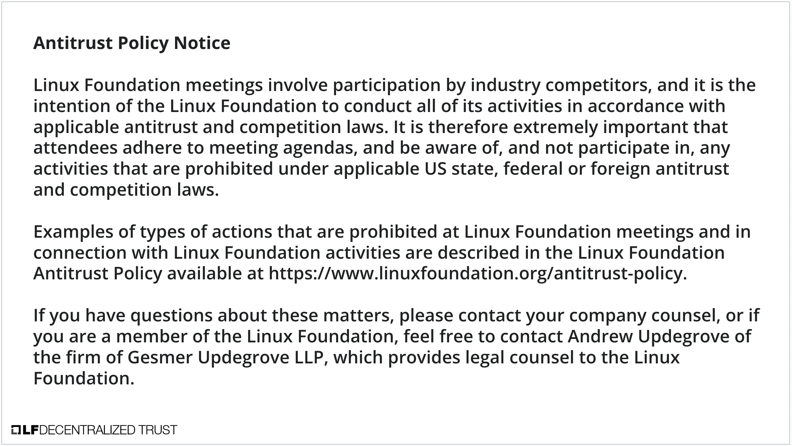
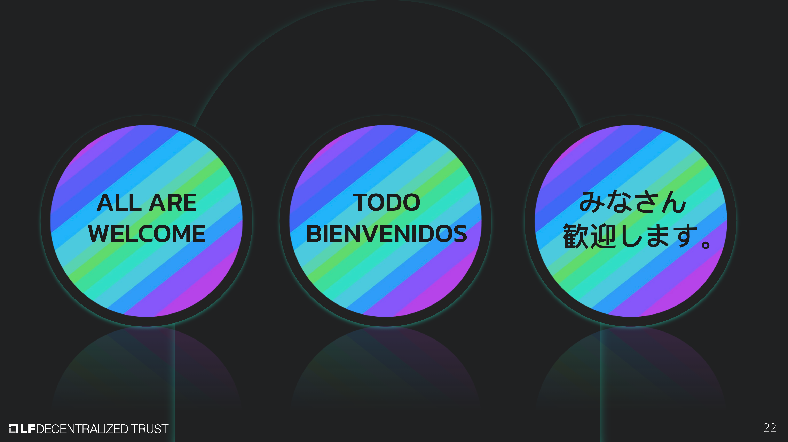

[//]: # (SPDX-License-Identifier: CC-BY-4.0)
# XXXX.YY.ZZ Open Tokenized Asset Standard Community Call

Linux Foundation Decentralized Trust is committed to creating a safe and welcoming community for all. For more information please visit our Code of Conduct: [LF Decentralized Trust Code of Conduct](../../governing-documents/code-of-conduct.md).

# Meeting Link
- [Join us on Zoom](https://zoom-lfx.platform.linuxfoundation.org/meeting/91869019714?password=b750bc97-3e2f-41d5-90f5-60392e0442dd))

# Attendance
- 

# Announcements
- 

# Agenda
- 

# Resources
- GitHub Organization: [https://github.com/OpenTokenizedAssetStandard](https://github.com/OpenTokenizedAssetStandard)
- Discord (the #opentokenizedassetstandard channel) : [https://discord.lfdecentralizedtrust.org/](https://discord.lfdecentralizedtrust.org/)
- Community Meetings: OTAS Community Meetings occur every other week on Tuesdays at the following times: 8-8:30amPT / 11-11:30am ET / 17-17:30 CET. You can find the Community Meeting Calendar here: [https://zoom-lfx.platform.linuxfoundation.org/meetings/open-tokenized-asset-standard](https://zoom-lfx.platform.linuxfoundation.org/meetings/open-tokenized-asset-standard). You can find Community Meeting agendas here: [https://github.com/OpenTokenizedAssetStandard/tsc/tree/main/community_meeting_agendas](https://github.com/OpenTokenizedAssetStandard/tsc/tree/main/community_meeting_agendas). In addition, all previous sessions recordings can be found on that's day's meeting entry.
  
# Recordings
- [Recordings, including transcript and chat, are available on the OTAS calendar](https://zoom-lfx.platform.linuxfoundation.org/meetings/open-tokenized-asset-standard?view=week)
- YouTube Playlist is here: [https://www.youtube.com/playlist?list=PL0MZ85B_96CHarXVG5-ASW_o4Y2GZgEY2](https://www.youtube.com/playlist?list=PL0MZ85B_96CHarXVG5-ASW_o4Y2GZgEY2)

# Upcoming meetings
- [Please check the calendar](https://zoom-lfx.platform.linuxfoundation.org/meetings/open-tokenized-asset-standard?view=week)

# Previous and Future Meeting Agendas
- Can be found in this folder: [https://github.com/OpenTokenizedAssetStandard/tsc/tree/main/community_meeting_agendas](https://github.com/OpenTokenizedAssetStandard/tsc/tree/main/community_meeting_agendas)
